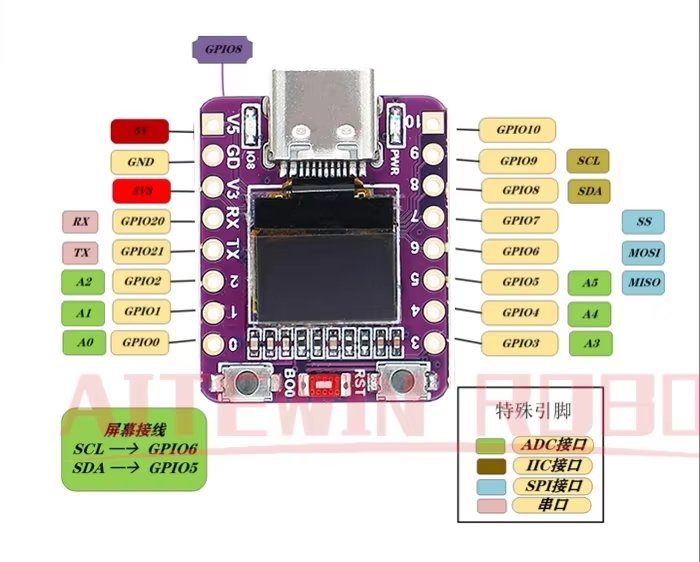

# ESP32-C3 OLED Miner Host

This firmware moves the TangMiner host loop from `scripts/mine.py` onto an ESP32-C3 OLED development board. The ESP32-C3 connects to WiFi with DHCP, speaks Stratum TCP to `public-pool.io:13333`, builds TangMiner UART work packets, reads FPGA `F` responses, validates hashes locally, and submits accepted shares.

## Board

Target board: `ESP32-C3 OLED development board with 0.42 inch OLED module ceramic antenna wifi Bluetooth ESP32 supermini development board`.

### Relevant Specs

- CPU Core: 32-bit RISC-V single-core processor (with FPU support)
- Clock Frequency: Up to 160 MHz
- In-Package Flash: 4 MB (embedded SPI flash)
- SRAM: 400 KB (including 16 KB dedicated for cache)
- ROM: 384 KB
- RTC SRAM: 8 KB
- Wi-Fi: 2.4 GHz IEEE 802.11 b/g/n (up to 150 Mbps data rate, supports 20/40 MHz bandwidth)
- USB-C: native ESP32-C3 USB serial/JTAG for flashing, logs, and power
- Operating Voltage: 3.0 V to 3.6 V
- OLED: 0.42 inch I2C OLED

> **OLED placement note:** this module is offset inside a 128x64 controller space; defaults use column offset `13` and page offset `1`, matching the advertised `(13, 14)` start point as closely as page-addressed text permits.

> **Important limitation:** ESP32-C3 USB is device-side serial/JTAG, not a USB host controller. A USB-C to USB-C cable cannot make the ESP32-C3 host the Tang Nano USB-UART. Use USB-C for power/flashing and wire the FPGA UART to ESP32-C3 GPIO UART pins.

## Connections



| Function | ESP32-C3 pin | Notes |
| --- | --- | --- |
| FPGA UART TX | GPIO21 / TX | Connect to FPGA `uart_rx_pin` header or bridge RX |
| FPGA UART RX | GPIO20 / RX | Connect to FPGA `uart_tx_pin` header or bridge TX |
| Ground | GND | Common ground with FPGA |
| OLED SCL | GPIO6 | Built-in display I2C clock |
| OLED SDA | GPIO5 | Built-in display I2C data |
| USB-C | USB serial/JTAG | Flashing, monitor, and power |
| 3V3 | 3.3 V | Logic level is 3.3 V |
| 5V | VBUS | Use only for power input/output as appropriate for your power split cable |

UART settings to the FPGA are `115200 8N1`, no flow control.

## Firmware

Main source: `mcu/mine.c`

Build system: PlatformIO with ESP-IDF.

Libraries and components:

- ESP-IDF WiFi station and DHCP via `esp_wifi`, `esp_netif`, and `esp_event`
- lwIP BSD sockets for Stratum TCP
- Managed ESP-IDF component `espressif/cjson` for Stratum JSON messages
- ESP-IDF UART driver for the TangMiner binary protocol
- ESP-IDF I2C driver for the built-in OLED
- Local SHA-256 implementation ported from the host script's compression logic
- Minimal built-in SSD1306-style OLED text driver, no third-party display dependency

## Build And Flash

From the repository root:

```sh
make mcu-build WIFI_SSID="your-wifi" WIFI_PASS="your-pass"
make mcu-flash MCU_PORT=COM12 WIFI_SSID="your-wifi" WIFI_PASS="your-pass"
make mcu-monitor MCU_PORT=COM12
```

Optional pool settings:

```sh
make mcu-flash \
  MCU_PORT=COM12 \
  WIFI_SSID="your-wifi" \
  WIFI_PASS="your-pass" \
  POOL_HOST="public-pool.io" \
  POOL_PORT=13333 \
  MINER_USER="bc1q...youraddress.worker" \
  MINER_PASS=""
```

PlatformIO downloads any missing ESP32 platform packages when `make mcu-build` is run.
